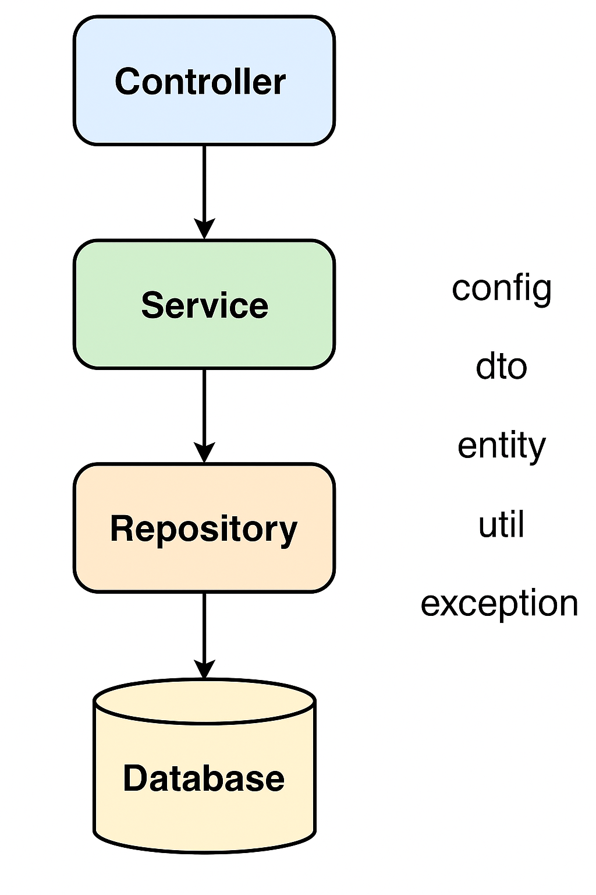

# 🧩 Spring Boot User CRUD API

A simple Spring Boot RESTful API that provides CRUD operations for managing users.  
Features:
- ✅ REST endpoints with `GET`, `POST`, `PUT`, `DELETE`
- 🗃️ In-memory H2 database
- 🧪 Unit & Web Layer tests using JUnit and MockMvc
- 📘 Swagger UI for API documentation

---

## 🚀 Tech Stack

- Java 17+
- Spring Boot 3.x
- Spring Web
- Spring Data JPA
- H2 Database
- JUnit 5
- Spring Test
- Swagger / OpenAPI

---

## 📂 Project Structure
```
src/
├── main/
│   ├── java/com/example/userservice/
│   │   ├── controller/     → Handles incoming HTTP requests
│   │   ├── service/        → Business logic layer
│   │   ├── repository/     → Data access layer (JPA)
│   │   ├── model/          → Entity classes
│   │   └── config/         → Configuration (Swagger, etc.)
│   └── resources/
│       ├── application.properties
├── test/
│   └── java/com/example/userservice/
│       ├── UserServiceTest.java
│       └── UserRepositoryTest.java
```

---

## ✅ Features
- Create, Read, Update, Delete Users
- Swagger UI for API documentation
- In-memory H2 database
- Unit tests for service and repository

---

## ⚙️ Setup & Run

1**Run the application**

▶️ Run Locally
```bash
./mvnw spring-boot:run
```
Then open:
```
http://localhost:8080/api/users
```

2**Access Swagger UI**
```
http://localhost:8080/swagger-ui/index.html
```

3**H2 Console**
```
http://localhost:8080/h2-console
```
- JDBC URL: `jdbc:h2:mem:testdb`

---


## ⚙️ Configuration

### 🔌 H2 In-Memory Database (in `src/test/resources/application.properties`)
```properties
spring.datasource.url=jdbc:h2:mem:testdb
spring.datasource.driverClassName=org.h2.Driver
spring.datasource.username=sa
spring.datasource.password=
spring.jpa.database-platform=org.hibernate.dialect.H2Dialect
spring.jpa.hibernate.ddl-auto=create-drop
spring.h2.console.enabled=true
```

## 📡 REST API Endpoints

| Method | Endpoint          | Description     |
| ------ | ----------------- | --------------- |
| GET    | `/api/users`      | Get all users   |
| GET    | `/api/users/{id}` | Get user by ID  |
| POST   | `/api/users`      | Create new user |
| PUT    | `/api/users/{id}` | Update user     |
| DELETE | `/api/users/{id}` | Delete user     |


## 🧪 Testing
### ✅ Unit Tests:
UserServiceTest: Tests service logic using mock repository

### ✅ Repository Test:
UserRepositoryTest: Uses in-memory H2 DB to test persistence

### ✅ Web Layer Test:
UserControllerTest: Tests REST endpoints using @WebMvcTest & MockMvc

Run tests using:
./mvnw test


## 🧭 Spring Boot Layer-by-Layer Workflow (Step-by-Step)

This explains **what happens internally** when a request hits your CRUD API:

### 🔁 1. **Client Sends HTTP Request**
> Example: `POST /api/users` with user data in JSON
This request reaches the **Controller layer** first.

### 🎮 2. **Controller Layer (`controller/`)**
- **Role:** Acts as the entry point for HTTP requests.
- **Responsibility:** Validates input and passes data to the service layer.
- **Example Flow:**
    - Receives request as `UserDTO`.
    - Calls `userService.createUser(userDTO)`.

### 🔧 3. **Service Layer (`service/`)**
- **Role:** Handles business logic.
- **Responsibility:** Converts DTO to Entity, applies rules, and interacts with the repository.
- **Example Flow:**
    - `User user = convertDtoToEntity(userDTO);`
    - Calls `userRepository.save(user);`
    - Returns saved entity or status.

### 🗃️ 4. **Repository Layer (`repository/`)**
- **Role:** Handles database operations.
- **Responsibility:** Performs actions like `save()`, `findById()`, `findAll()`, `deleteById()`, etc.
- **Example:**
    - `userRepository.save(user)` inserts the user into the database (H2 or MySQL).
    - Returns the saved user object.

### 🧬 5. **Entity Layer (`model/`)**
- **Role:** Represents the database table as a Java class.
- **Responsibility:** Maps to columns via JPA annotations (`@Entity`, `@Id`, etc.).
- **Example:**
    - `User.java` → Table: `users`
    - Fields like `id`, `name`, and `email` become columns.

### 🛠️ 6. **Config Layer (`config/`)**
- **Role:** Configures Spring Beans, Swagger, security, database, etc.
- **Responsibility:** Sets up Swagger (`@OpenAPIDefinition`), enables H2 Console, etc.
- **Example:**
    - SwaggerConfig to generate API docs
    - CORS config, custom exception handlers, etc.

### 🔁 Response Returns to Client
- The saved user (or result) flows back:
  ```
  Repository → Service → Controller → Client (as JSON response)
  ```

### ✅ Example: Save a New User
```bash
curl -X POST http://localhost:8080/api/users \
  -H "Content-Type: application/json" \
  -d '{"name": "Yasiru", "email": "yasiru@example.com"}'
```
**Internally:**
1. Controller receives request
2. Service processes DTO
3. Repository saves Entity
4. Response (saved user with ID) returns to client

---


## 🧑‍💻 Author
Yasiru Nadeesha Aththanayaka
Software Engineering Student | Full-Stack Developer
University of Westminster